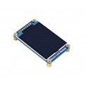
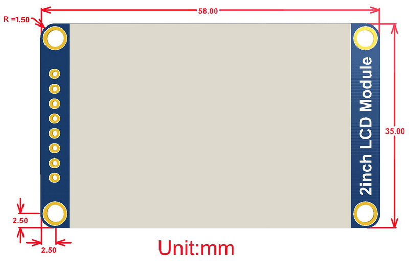
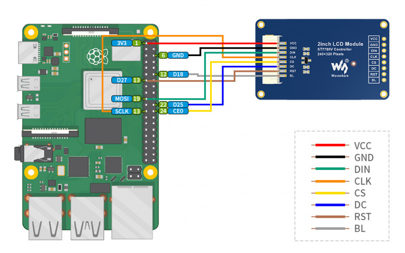

# HRV monitoring system demo - Pi side

This repository stores the codes of the Pi side for the heart rate variability monitoring system demo.

[HRV monitoring system demo - MSP430 side](https://github.com/jingye-xu/HRV_Monitor_System_Demo_MSP430/blob/main/README.md)

## Content

[Hardware introduction](README.md#hardware)

[Usage](README.md#usage)

## Hardware

### Display



This is a general LCD display Module, IPS screen, 2inch diagonal, 240×320 resolution, with embedded controller, communicating via SPI interface.
[Product link](https://www.waveshare.com/2inch-lcd-module.htm)

#### Specifications

* Driver: ST7789
* Interface: SPI
* Display color: RGB, 262K color
* Resolution: 240×320
* Backlight: LED
* Operating voltage: 3.3V/5V

#### Interfaces

| SYMBOL |                       DESCRIPTION                       |
|:------:|:-------------------------------------------------------:|
|   VCC  |                  Power (3.3V/5V input)                  |
|   GND  |                          Ground                         |
|   DIN  |                      SPI data input                     |
|   CLK  |                     SPI clock input                     |
|   CS   |                Chip selection, low active               |
|   DC   | Data/Command selection (high for data, low for command) |
|   RST  |                    Reset, low active                    |
|   BL   |                        Backlight                        |

#### Dimensions



### PPG Sensor

[Product Link](https://www.amazon.com/gp/product/B076LQKQFF/ref=ppx_yo_dt_b_asin_title_o05_s00?ie=UTF8&psc=1)

### MSP430FR5994

### Raspberry Pi 4B

## Connections

### Connect display to Pi

| LCD | BCM2835      | Board |
|-----|--------------|-------|
| VCC | 3.3V         | 3.3V  |
| GND | GND          | GND   |
| DIN | MOSI         | 19    |
| CLK | SCLK         | 23    |
| CS  | CE0          | 24    |
| DS  | 25           | 22    |
| RST | 27           | 13    |
| BL  | 18           | 12    |



## Usage

Original document: [2inch_LCD_Module Works with Raspberry Pi](https://www.waveshare.com/wiki/2inch_LCD_Module#Working_with_Raspberry_Pi)

### 1. Enable SPI interface

Open the terminal:

```bash
sudo raspi-config
Choose Interfacing Options -> SPI -> Yes  to enable SPI interface
```

Reboot to enable the SPI interface:

```bash
sudo reboot
```

### 2. Install libraries

Install BCM2835 libraries through terminal

```bash
wget http://www.airspayce.com/mikem/bcm2835/bcm2835-1.71.tar.gz
tar zxvf bcm2835-1.71.tar.gz
cd bcm2835-1.71/
sudo ./configure && sudo make && sudo make check && sudo make install
```

Install wiringPi libraries (choose 1 of following):

(Option 1) For Bullseye branch system(newest Raspberry Pi 64bit Ubuntu OS):
```bash
git clone https://github.com/WiringPi/WiringPi
cd WiringPi
./build
gpio -v
# Run gpio -v and version 2.60 will appear. If it does not appear, it means that there is an installation error
```

(Option 2) For older branch systems:
```bash
#Open the Raspberry Pi terminal and run the following command
sudo apt-get install wiringpi
#For Raspberry Pi systems after May 2019 (earlier than before, you may not need to execute), you may need to upgrade:
wget https://project-downloads.drogon.net/wiringpi-latest.deb
sudo dpkg -i wiringpi-latest.deb
gpio -v
# Run gpio -v and version 2.52 will appear. If it does not appear, the installation is wrong
```

### 3. Try display official examples (optional)

Download examples:
```bash
sudo apt-get install unzip -y
sudo wget https://www.waveshare.com/w/upload/8/8d/LCD_Module_RPI_code.zip
sudo unzip ./LCD_Module_RPI_code.zip 
cd LCD_Module_RPI_code/RaspberryPi/
```

Enter the python examples folder:
```bash
cd python/examples
```

Try examples under `python/examples/` folder:
```bash
# python2
sudo python 2inch_LCD_test.py

# or python3
sudo python3 2inch_LCD_test.py
```

### 4. Download our code and install required libraries

```bash
git clone https://github.com/jingye-xu/HRV_Monitor_System_Demo_Pi.git
cd HRV_Monitor_System_Demo_Pi
python3 -m pip install -r requirements.txt
```

### 5. Modify serial port and run

Find the serial port and modify demo.py accordingly:
```bash
ls /dev | grep tty
```
Change the port variable accordingly:
```bash
nano serialport.py
```

### 6. Setup autorun after booting (optional)

#### 1). Create service file

```bash
sudo touch /lib/systemd/system/display_demo.service
```
Add following into the file.
**Note**: change {your path} to your path.
```
[Unit]
Description=display demo
After=multi-user.target
[Service]
Type=idle
ExecStart=python3 {your path}/demo.py
[Install]
WantedBy=multi-user.target
```

#### 2). Reload daemon

```bash
sudo systemctl daemon-reload
```

#### 3). Enable and start service

```bash
sudo systemctl enable display_demo.service && sudo systemctl start display_demo.service
```
